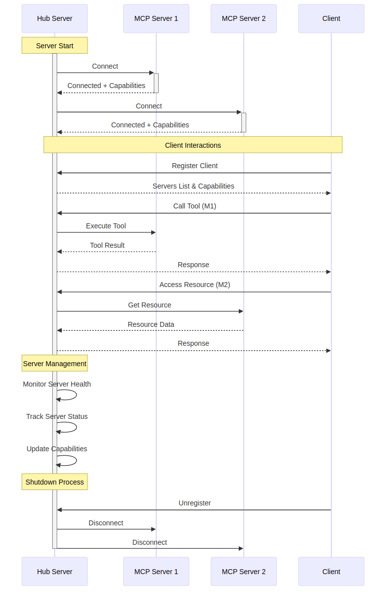
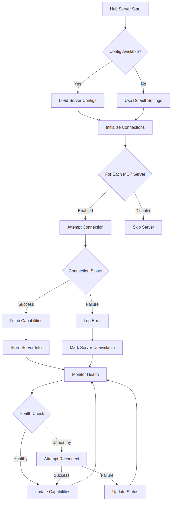
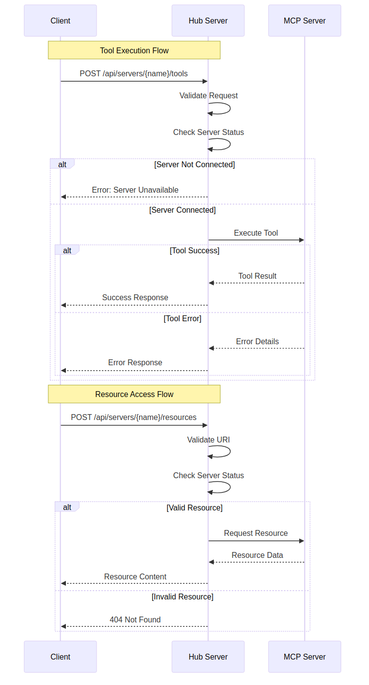

# MCP Hub

[](https://www.npmjs.com/package/mcp-hub)
[](https://opensource.org/licenses/MIT)
[](./CONTRIBUTING.md)

A centralized manager for Model Context Protocol (MCP) servers that provides:

- Dynamic MCP server management and monitoring
- REST API for tool execution and resource access
- Real-time server status tracking
- Client connection management
- Process lifecycle handling

## Overview

### Hub Server vs MCP Servers

- **Hub Server (MCP Hub)**

  - Central management server that connects to and manages multiple MCP servers
  - Provides unified API endpoints for clients to access MCP server capabilities
  - Handles server lifecycle, health monitoring, and client connections
  - Routes requests between clients and appropriate MCP servers

- **MCP Servers**
  - Individual servers that provide specific tools and resources
  - Each server has its own capabilities (tools, resources, templates)
  - Connected to and managed by the Hub server
  - Process requests from clients through the Hub

## Installation

```bash
npm install -g mcp-hub
```

## Basic Usage

Start the hub server:

```bash
mcp-hub --port 3000 --config path/to/config.json
```

### CLI Options

```bash
Options:
  --port            Port to run the server on (default: 3000)
  --config          Path to config file (required)
  --watch           Watch config file for changes (default: false)
  --shutdown-delay  Delay in milliseconds before shutting down when no clients are connected (default: 0)
  -h, --help       Show help information
```

The server outputs JSON-formatted status messages on startup and state changes:

```json
{
  "status": "ready",
  "server_id": "mcp-hub",
  "version": "1.0.0",
  "port": 3000,
  "pid": 12345,
  "servers": [],
  "timestamp": "2024-02-20T05:55:00.000Z"
}
```

## Configuration

MCP Hub uses a JSON configuration file to define managed servers:

```json
{
  "mcpServers": {
    "example-server": {
      "command": "npx example-mcp-server",
      "args": ["--config", "server-config.json"],
      "env": {
        "API_KEY": "", // Will use process.env.API_KEY
        "DEBUG": "true", // Will use this value
        "SECRET_TOKEN": null // Will use process.env.SECRET_TOKEN
      },
      "disabled": false
    }
  }
}
```

### Configuration Options

- **command**: Command to start the MCP server
- **args**: Array of command line arguments
- **env**: Environment variables for the server. If a variable is specified with a falsy value (empty string, null, undefined), it will fall back to using the corresponding system environment variable if available.
- **disabled**: Whether the server is disabled (default: false)

## Example Integrations

### Neovim Integration

The [ravitemer/mcphub.nvim](https://github.com/ravitemer/mcphub.nvim) plugin provides seamless integration with Neovim, allowing direct interaction with MCP Hub from your editor:

- Execute MCP tools directly from Neovim
- Access MCP resources within your editing workflow
- Real-time status updates in Neovim
- Custom commands for common MCP operations

## Logging

MCP Hub uses structured JSON logging for all events:

```json
{
  "type": "error",
  "code": "TOOL_ERROR",
  "message": "Failed to execute tool",
  "data": {
    "server": "example-server",
    "tool": "example-tool",
    "error": "Invalid parameters"
  },
  "timestamp": "2024-02-20T05:55:00.000Z"
}
```

Log levels include:

- `info`: Normal operational messages
- `warn`: Warning conditions
- `debug`: Detailed debug information
- `error`: Error conditions (includes error code and details)

## REST API

### Health and Status

#### Health Check

```bash
GET /api/health
```

Response:

```json
{
  "status": "ok",
  "server_id": "mcp-hub",
  "version": "1.0.0",
  "activeClients": 2,
  "timestamp": "2024-02-20T05:55:00.000Z",
  "servers": []
}
```

#### List MCP Servers

```bash
GET /api/servers
```

#### Get Server Info

```bash
GET /api/servers/:name/info
```

#### Refresh Server Capabilities

```bash
POST /api/servers/:name/refresh
```

Response:

```json
{
  "status": "ok",
  "server": {
    "name": "example-server",
    "capabilities": {
      "tools": ["tool1", "tool2"],
      "resources": ["resource1", "resource2"],
      "resourceTemplates": []
    }
  },
  "timestamp": "2024-02-20T05:55:00.000Z"
}
```

#### Refresh All Servers

```bash
POST /api/refresh
```

Response:

```json
{
  "status": "ok",
  "servers": [
    {
      "name": "example-server",
      "capabilities": {
        "tools": ["tool1", "tool2"],
        "resources": ["resource1", "resource2"],
        "resourceTemplates": []
      }
    }
  ],
  "timestamp": "2024-02-20T05:55:00.000Z"
}
```

#### Start Server

```bash
POST /api/servers/:name/start
```

Response:

```json
{
  "status": "ok",
  "server": {
    "name": "example-server",
    "status": "connected",
    "uptime": 123
  },
  "timestamp": "2024-02-20T05:55:00.000Z"
}
```

#### Stop Server

```bash
POST /api/servers/:name/stop?disable=true|false
```

The optional `disable` query parameter can be set to `true` to disable the server in the configuration.

Response:

```json
{
  "status": "ok",
  "server": {
    "name": "example-server",
    "status": "disconnected",
    "uptime": 0
  },
  "timestamp": "2024-02-20T05:55:00.000Z"
}
```

### Client Management

#### Register Client

```bash
POST /api/client/register
{
  "clientId": "unique_client_id"
}
```

#### Unregister Client

```bash
POST /api/client/unregister
{
  "clientId": "unique_client_id"
}
```

### MCP Server Operations

#### Execute Tool

```bash
POST /api/servers/:name/tools
{
  "tool": "tool_name",
  "arguments": {}
}
```

#### Access Resource

```bash
POST /api/servers/:name/resources
{
  "uri": "resource://uri"
}
```

## Real-time Updates

The Hub Server provides real-time updates via Server-Sent Events (SSE) at `/api/events`. Connect to this endpoint to receive real-time updates about server status, client connections, and capability changes.

### Event Types

1. **server_info** - Initial connection information

```json
{
  "server_id": "mcp-hub",
  "version": "1.0.0",
  "status": "connected",
  "pid": 12345,
  "port": 3000,
  "activeClients": 1,
  "timestamp": "2024-02-20T05:55:00.000Z"
}
```

2. **server_ready** - Server started and ready

```json
{
  "status": "ready",
  "server_id": "mcp-hub",
  "version": "1.0.0",
  "port": 3000,
  "pid": 12345,
  "servers": [],
  "timestamp": "2024-02-20T05:55:00.000Z"
}
```

3. **client_registered/unregistered** - Client connection events

```json
{
  "activeClients": 2,
  "clientId": "client_123",
  "timestamp": "2024-02-20T05:55:00.000Z"
}
```

4. **tool_list_changed** - Server's tools list has changed

```json
{
  "type": "TOOL",
  "server": "example-server",
  "tools": ["tool1", "tool2"],
  "timestamp": "2024-02-20T05:55:00.000Z"
}
```

5. **resource_list_changed** - Server's resources list has changed

```json
{
  "type": "RESOURCE",
  "server": "example-server",
  "resources": ["resource1", "resource2"],
  "resourceTemplates": [],
  "timestamp": "2024-02-20T05:55:00.000Z"
}
```

## Error Handling

MCP Hub implements a comprehensive error handling system with custom error classes for different types of errors:

### Error Classes

- **ConfigError**: Configuration-related errors (invalid config, missing fields)
- **ConnectionError**: Server connection issues (failed connections, transport errors)
- **ServerError**: Server startup/initialization problems
- **ToolError**: Tool execution failures
- **ResourceError**: Resource access issues
- **ValidationError**: Request validation errors

Each error includes:

- Error code for easy identification
- Detailed error message
- Additional context in the details object
- Stack trace for debugging

Example error structure:

```json
{
  "code": "CONNECTION_ERROR",
  "message": "Failed to communicate with server",
  "details": {
    "server": "example-server",
    "error": "connection timeout"
  },
  "timestamp": "2024-02-20T05:55:00.000Z"
}
```

### Error Categories

1. **Configuration Errors**

   - Invalid config format
   - Missing required fields
   - Environment variable issues

2. **Server Management Errors**

   - Connection failures
   - Lost connections
   - Capability fetch issues
   - Server startup problems

3. **Request Processing Errors**

   - Invalid parameters
   - Server availability
   - Tool execution failures
   - Resource access issues

4. **Client Management Errors**
   - Registration failures
   - Duplicate registrations
   - Invalid client IDs

## Architecture

### Hub Server Lifecycle



The Hub Server coordinates communication between clients and MCP servers:

1. Starts and connects to configured MCP servers
2. Manages client registrations
3. Routes tool execution and resource requests
4. Handles server monitoring and health checks
5. Performs clean shutdown of all connections

### MCP Server Management



The Hub Server actively manages MCP servers through:

1. Configuration-based server initialization
2. Connection and capability discovery
3. Health monitoring and status tracking
4. Automatic reconnection attempts
5. Server state management

### Request Handling



All client requests follow a standardized flow:

1. Request validation
2. Server status verification
3. Request routing to appropriate MCP server
4. Response handling and error management

## Requirements

- Node.js >= 18.0.0
- npm >= 9.0.0

## Contributing

Please read our [Contributing Guidelines](./CONTRIBUTING.md) for details on our code of conduct and the process for submitting pull requests.

## Security

For security-related issues, please review our [Security Policy](./SECURITY.md) and follow the vulnerability reporting process.

## Changelog

See [CHANGELOG.md](./CHANGELOG.md) for a list of all notable changes.

## Code of Conduct

Please note that this project is released with a [Code of Conduct](./CODE_OF_CONDUCT.md). By participating in this project you agree to abide by its terms.

## License

This project is licensed under the MIT License - see the [LICENSE.md](./LICENSE.md) file for details.
